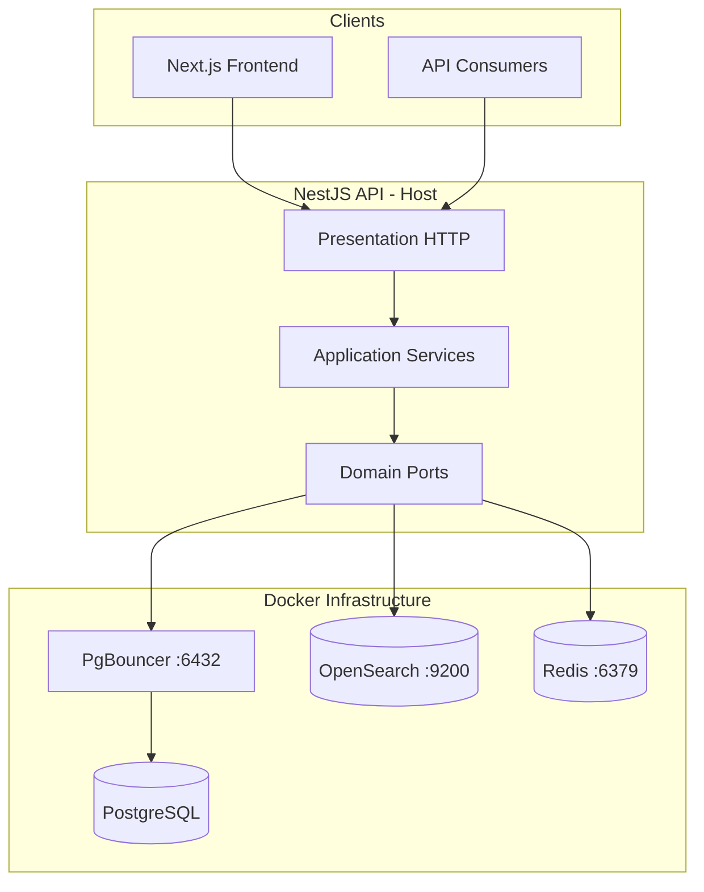

# System Context & Data Flows

## Runtime topology



## Store responsibilities

| Store | Role | Data |
|-------|------|------|
| **PostgreSQL** | System of record | categories, products, attributes, saved_searches |
| **OpenSearch** | Search-optimized projection | denormalized product documents for list/facets/autocomplete |
| **Redis** | Ephemeral / acceleration | response cache, session IDs, rate-limit counters, index job queue |

PostgreSQL and OpenSearch are **eventually consistent** for catalog reads: writes go to Postgres first; OpenSearch is updated via queue or sync fallback.

---

## Read paths

### Product list / search

```
GET /products?q=...&brand=...
  → ProductsController
  → ProductsService.listProducts()
  → IProductSearchRepository.findMany()
       [optional] CachedProductSearchRepository (Redis)
       → OpenSearchProductSearchRepository OR PostgresProductSearchRepository
  → ProductsPresenter → JSON
```

### Product detail

```
GET /products/:id
  → ProductsService.getProduct()
  → IProductRepository.findById()
       [optional] CachedProductRepository → ProductRepository (TypeORM → Postgres)
```

Detail reads **never** hit OpenSearch — correct for rich relational data.

---

## Write path (today)

```
POST/PATCH /products
  → ProductsService.createProduct / updateProduct
  → IProductRepository (CachedProductRepository when Redis on)
       → ProductRepository → Postgres
       → afterCatalogWrite():
            CacheInvalidationService (bump cache version)
            ProductIndexQueueService.enqueueOrIndex()
                 → Redis LPUSH queue → worker → ProductIndexerService → OpenSearch
```

**Note:** Side effects run inside the cache decorator, not in the application service.

---

## Redis usage map

| Feature | Mechanism | Config |
|---------|-----------|--------|
| Response cache | `RedisCacheService.wrap()` + versioned keys | `REDIS_TTL_*` |
| Cache bust on write | Increment `cache:version` | `cacheVersionKey` |
| Sessions | Cookie + Redis session store | `REDIS_SESSION_TTL_SEC` |
| Rate limiting | Middleware token bucket in Redis | `REDIS_RATE_LIMIT_*` |
| Index queue | `LPUSH` / blocking pop worker | `indexQueueKey` |

Single Redis instance, multiple concerns — fine at this scale; could split by DB index or key prefix only if traffic grows.

---

## Configuration matrix

| Mode | Postgres | OpenSearch | Redis | Behavior |
|------|----------|------------|-------|----------|
| Full stack (default) | ✓ | ✓ | ✓ | Production-like |
| DB only | ✓ | ✗ | ✗ | `OPENSEARCH_ENABLED=false`, `REDIS_ENABLED=false` |
| No search index | ✓ | ✗ | ✓ | Postgres list/search fallback |

See `.env.example` and `docker-compose.db-only.yml` in the project root.
