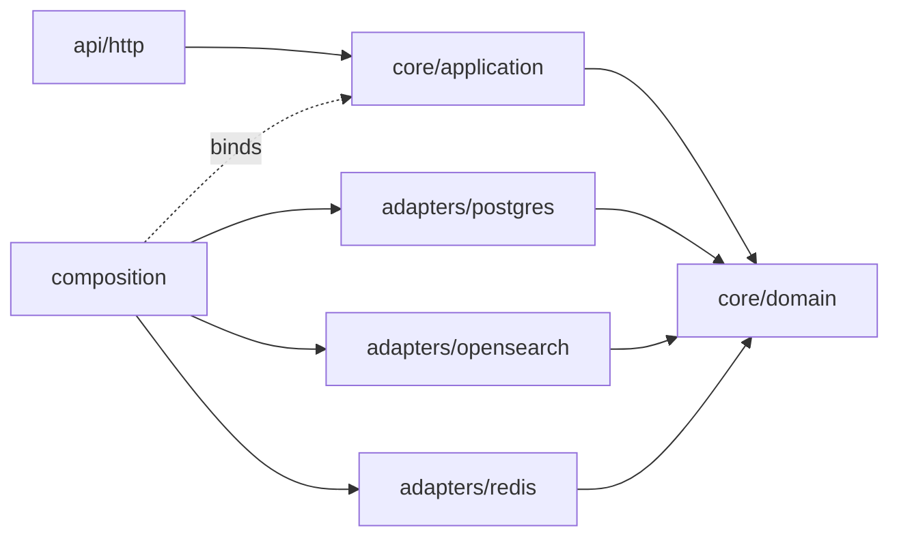

# Refined Layered Architecture

A **simpler** target layout: same four conceptual layers, but with a explicit **composition root** and **flat adapters** instead of tangled Nest modules.

## Design principles

1. **Domain + application = core** — no framework imports.
2. **Adapters implement ports** — one folder per technology, no cross-adapter imports.
3. **Composition root wires everything** — single module owns all `useFactory` providers.
4. **Application orchestrates writes** — cache invalidation and indexing are explicit steps, not hidden in decorators.
5. **Keep decorators for reads only** — caching reads is a pure cross-cutting concern; writes stay in use cases.

---

## Target folder structure

```
src/
  main.ts
  app.module.ts                    # imports CompositionModule + HttpModule only

  core/
    domain/                        # models, ports, domain errors (unchanged conceptually)
      products/
      categories/
      saved-searches/
      common/
    application/                   # use cases
      products/
        products.service.ts          # read use cases
        product-catalog.service.ts   # write use cases + orchestration (NEW)
      categories/
      saved-searches/

  adapters/
    postgres/                        # was database/ + persistence/repositories
      postgres.module.ts           # TypeORM forFeature, exports repos
      entities/
      migrations/
      mappers/
      product.repository.ts
      category.repository.ts
      saved-search.repository.ts
      product-search-fallback.repository.ts   # rename from postgres-product-search

    opensearch/
      opensearch.module.ts
      opensearch.client.ts
      product-search.repository.ts
      product-indexer.service.ts
      index.service.ts

    redis/
      redis.module.ts              # client, cache, session, rate-limit only
      cache.service.ts
      session.service.ts
      rate-limit.middleware.ts
      decorators/                  # read-only cache wrappers
        cached-product.repository.ts
        cached-product-search.repository.ts
        ...

    queue/                         # optional: extract index queue from search
      product-index-queue.service.ts

  composition/
    composition.module.ts          # ALL port → adapter bindings
    repository.providers.ts
    search.providers.ts

  api/                             # was presentation/http
    http/
      products/
      categories/
      saved-searches/
      health/
      common/                      # filters, middleware (session), decorators

  platform/
    config/
    logging/
```

**What changed vs today**

| Today | Refined |
|-------|---------|
| `database/` + `infrastructure/persistence/` | `adapters/postgres/` |
| `infrastructure/search/` | `adapters/opensearch/` + `adapters/queue/` |
| `infrastructure/redis/` | `adapters/redis/` |
| `search.providers.ts` splits across modules | `composition/*.providers.ts` |
| Write side effects in `CachedProductRepository` | `ProductCatalogService` orchestrates |

---

## Dependency rules

```
api          →  core.application  →  core.domain
composition  →  adapters.*        →  core.domain (ports only)
adapters     →  core.domain       (never api or application)
core         →  (nothing external)
```



---

## Write orchestration (recommended pattern)

Move side effects from `CachedProductRepository` into application layer:

```typescript
// core/application/products/product-catalog.service.ts
@Injectable()
export class ProductCatalogService {
  constructor(
    @Inject(PRODUCT_REPOSITORY) private readonly products: IProductRepository,
    @Inject(CACHE_INVALIDATOR) private readonly cache: ICacheInvalidator,
    @Inject(PRODUCT_INDEX_SYNC) private readonly indexSync: IProductIndexSync,
  ) {}

  async createProduct(cmd: CreateProductCommand): Promise<Product> {
    // validation (category, sku, slug) stays here or in ProductsService
    const product = await this.products.create(input);
    await this.cache.onCatalogMutation();
    await this.indexSync.afterProductChange(product.id);
    return product;
  }
}
```

New small ports in domain:

```typescript
// core/domain/platform/cache-invalidator.port.ts
export interface ICacheInvalidator {
  onCatalogMutation(): Promise<void>;
}

// core/domain/products/product-index-sync.port.ts
export interface IProductIndexSync {
  afterProductChange(productId: number): Promise<void>;
}
```

Adapters implement these; `CachedProductRepository` becomes **read-only** cache wrapper.

**Why:** Application layer documents the business transaction story; adapters stay dumb.

---

## Composition module (single wiring point)

```typescript
// composition/composition.module.ts
@Global()
@Module({
  imports: [PostgresModule, OpenSearchModule, RedisModule, QueueModule],
  providers: [
    ...postgresRepositoryProviders,
    ...searchProviders,
    ...cacheDecoratorProviders,
  ],
  exports: [PRODUCT_REPOSITORY, PRODUCT_SEARCH_REPOSITORY, /* ... */],
})
export class CompositionModule {}
```

All `config.get('redis.enabled') ? cached : inner` logic lives here — not split between PersistenceModule and SearchModule.

---

## Nest module simplification

**Today:** `AppModule` imports DatabaseModule, RedisModule, PersistenceModule, feature modules.

**Refined:**

```typescript
@Module({
  imports: [
    ConfigModule.forRoot({ ... }),
    PlatformModule,        // logging, database bootstrap
    CompositionModule,     // wires all ports
    ProductsHttpModule,
    CategoriesHttpModule,
    // ...
  ],
})
export class AppModule {}
```

Feature HTTP modules import nothing from adapters directly — only application services.

---

## What we intentionally did NOT add

- Separate microservices for search or indexing
- Event sourcing / full CQRS buses
- Generic repository base classes
- Extra DDD building blocks (aggregates, domain events) unless catalog rules grow

This keeps the learning curve aligned with the current project size (~120 source files).

---

## Incremental migration path

| Step | Effort | Risk |
|------|--------|------|
| 1. Add `ICacheInvalidator` + `IProductIndexSync` ports; delegate from cached repo | Small | Low |
| 2. Move write methods to `ProductCatalogService` with explicit orchestration | Small | Low |
| 3. Extract `composition/` module; move providers from `search.providers.ts` | Medium | Medium |
| 4. Rename/move folders to `adapters/postgres`, `adapters/opensearch` | Medium | Low (mostly moves) |
| 5. Rename `presentation` → `api` | Trivial | None |

Do steps 1–2 first for the biggest clarity win with minimal file churn.

See [blueprint/](./blueprint/) for file-level examples of ports and composition.
